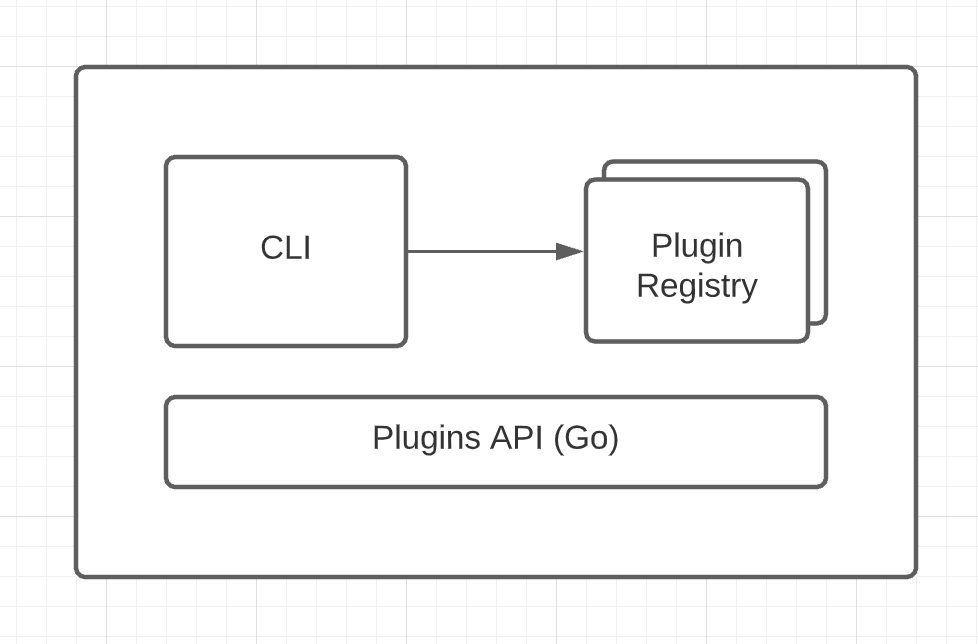

### The general picture
To start lets take a high level view of the Ox CLI.



The Ox Cli has a few components:
- The CLI, This is the point of contact with users, parsing parameters and selecting the right commands from the plugin registry.
- The Plugin registry, is a collection of plugins that are loaded either by default or manipulated by the user in the `cmd/ox/main.go` file.
- The Plugins API, is a small set of functions to manage the Plugin registry, this is how applications can manipulate the plugin registry.

### How does the CLI manages Plugins?

The magic of writing/using plugins happens in the ```cmd/ox/main.go``` file, this file can be generated by Ox when the codebase wants to specify its own plugins, The Ox binary looks for that file, and in case found it will attempt at executing it. It typically looks like:

```go
package main

import (
    "context"
    "fmt"
    "log"
    "os"

    "yourapp"
    _ "yourapp/app/tasks"
    _ "yourapp/app/models"

    "github.com/wawandco/ox/cli"
    "github.com/wawandco/ox/plugins/tools/soda"
)

// main function for the tooling cli, will be invoked by Ox
// when found in the source code. In here you can add/remove plugins that
// your app will use as part of its lifecycle.
func main() {
    // using Soda Plugins
    cli.Use(soda.Plugins(yourapp.Migrations)...)
    err := cli.Run(context.Background(), os.Args)
    if err != nil {
        fmt.Printf("[error] %v \n", err.Error())

        os.Exit(1)
    }
}
```

And can be generated by running:

```
ox generate ox
```
